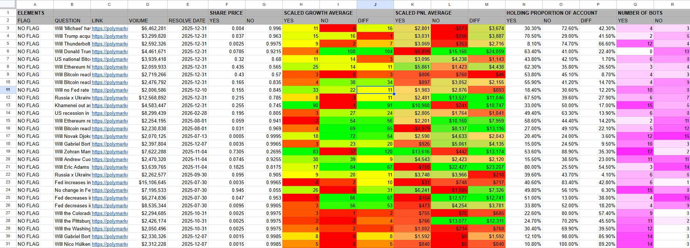

# PolyBotScan
  
## Overview

PolyBotScan is a tool designed to analyze the 40 largest holders of a specified PolyMarket question. It collects wallet data, performs analytics, and posts summarized results to a Discord channel and a Google sheet for real-time visibility.

## Features

- Fetches and analyzes the top 40 token holders from the blockchain.
- Aggregates wallet data, including balances and transaction history.
- Generates summary statistics and insights.
- Automatically posts formatted reports to a Discord server and google sheet upon configuration.
- Daily Summary of User Position Metrics and Performance Statistics.
- Allows live configuration of bot settings using the -set <key> <value> command while the bot is running.

## Displays




## Installation

1. Clone the repository:
   ```bash
   git clone https://github.com/Owongit/PolyBotScan.git
   cd PolyBotScan
   ```
2. Install dependencies:
   ```bash
   pip install -r requirements.txt
   ```

## Configuration

- Edit `config.json` to set your proxywallet ID, token contract address, Discord webhook URL, and other parameters.
- Edit json_functs.py and helper_functs.py to contain the correct .json file paths. (replace my...json file path).
## Usage

Run the main script:
```bash
python main.py
```

## Contributing

Contributions are welcome! Please open issues or submit pull requests for improvements.

